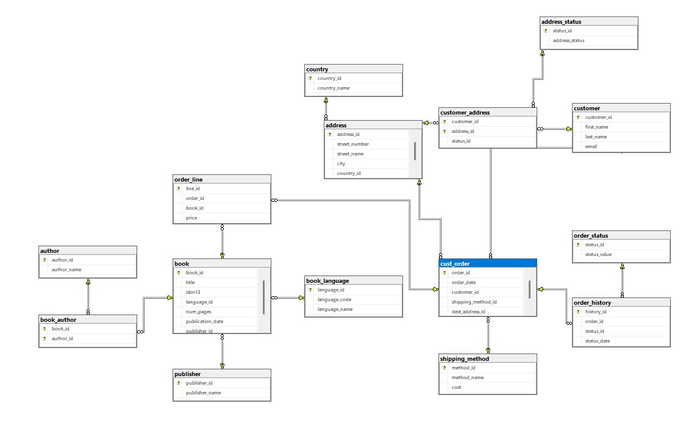
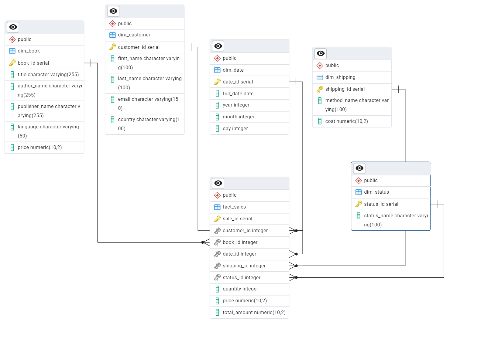

# 📊 Data Warehouse Project - Bookstore

## 👤 Student

**Amran Al-gaafari**

---

## 📌 Project Overview

This project demonstrates the process of transforming an OLTP (Online Transaction Processing) database into a Data Warehouse (OLAP) using the **Star Schema** design.

The original database contains normalized tables for managing a bookstore system (customers, books, orders, etc.).
The goal is to restructure it into a format optimized for analytical queries and reporting.

---

## 🧱 OLTP Database Schema

The original database structure (normalized):



---

## ⭐ Data Warehouse Schema (Star Schema)

The transformed schema using Data Warehouse design:



---

## ⚙️ ETL Implementation

A Python script (`oltp_to_olap.py`) was created to demonstrate a simplified ETL process for transforming OLTP data into a Data Warehouse schema.

The script demonstrates the ETL (Extract, Transform, Load) concept using sample data and exports the resulting tables as CSV files.

The script reflects the designed Star Schema by generating the corresponding fact and dimension tables.

### 🔄 Steps performed:

* **Extract:** Sample data was created to represent OLTP tables
* **Transform:**

  * Data was structured into dimension tables
  * A central fact table was created
  * Derived column `total_amount` was calculated
* **Load:** The final Data Warehouse tables were saved as CSV files in the `output/` directory

### 📁 Output Files:

* dim_customer.csv
* dim_book.csv
* dim_date.csv
* dim_shipping.csv
* dim_status.csv
* fact_sales.csv

> This script is for demonstration purposes to show how OLTP data can be transformed into an OLAP structure.

---

## 🧠 Design Approach

### ✔ Fact Table

* **fact_sales**

  * Represents transactional sales data
  * Contains measurable values:

    * price
    * quantity
    * total_amount

---

### 📦 Dimension Tables

#### 1. dim_customer

* Stores customer information

#### 2. dim_book

* Stores book details
* Includes:

  * author_name
  * publisher_name
  * language

> Note: Book-related attributes were denormalized into a single table to improve query performance.

---

#### 3. dim_date

* Used for time-based analysis
* Includes:

  * year
  * month
  * day

---

#### 4. dim_shipping

* Contains shipping methods and costs

---

#### 5. dim_status

* Stores order status values

---

## 🔄 Transformation Logic

The transformation includes:

* Joining multiple OLTP tables
* Flattening data into dimension tables
* Creating a central fact table
* Removing unnecessary normalization

---

## 📊 Fact Table Logic

* **total_amount = price × quantity**

This design follows the Star Schema principle where the fact table is connected to multiple dimension tables for efficient analytical queries.

---

## 🎯 Benefits of Data Warehouse

* Faster analytical queries
* Simplified data structure
* Better reporting and insights
* Optimized for BI tools

---

## 📁 Project Structure

* `scripts/` → contains ETL script
* `output/` → contains generated Data Warehouse tables
* `diagrams/` → contains OLTP and DW schema images
* `README.md` → project documentation

---

## ▶️ How to Run

1. Navigate to the project folder:

```bash
cd Data-Warehouse-Bookstore
```

2. Run the ETL script:

```bash
python scripts/oltp_to_olap.py
```

3. Check the generated files in:

```bash
output/
```

---

## 🛠 Tools Used

* PostgreSQL
* pgAdmin (ERD visualization)
* Python (pandas)
* Star Schema modeling

---

## ✅ Conclusion

This project demonstrates a clear understanding of Data Warehouse design principles, including Star Schema modeling and ETL processes, making it suitable for analytical workloads.

---
