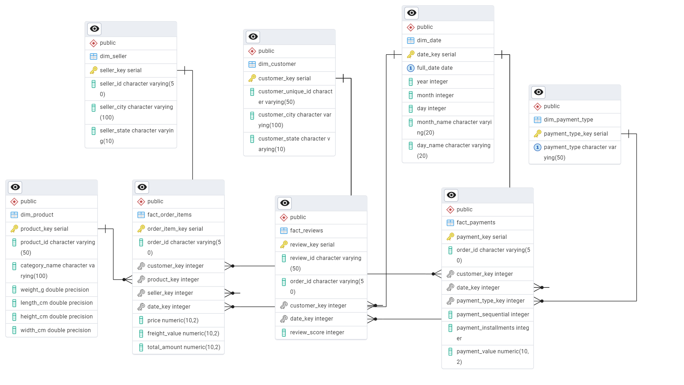

# 📊 Olist E-commerce Data Warehouse

## 👤 Student

**Amran Al-gaafari**

---

## 📌 Project Overview

This project demonstrates the full process of building a **Data Warehouse (OLAP)** from an **OLTP system** using the Olist e-commerce dataset.

The pipeline includes:

* Data extraction from SQLite
* Data transformation using Python (pandas)
* Loading into PostgreSQL Data Warehouse
* Analytical queries for business insights

---

## 🧱 Architecture

```text
SQLite (OLTP)
   ↓
Python ETL Pipeline
   ↓
PostgreSQL Data Warehouse
   ↓
Analytical Queries (SQL)
```

---

## 🧩 Data Modeling

### ⭐ Star Schema Design

The Data Warehouse follows a **Star Schema** approach.

### 📦 Fact Tables

* **fact_order_items** → Sales transactions
* **fact_payments** → Payment data
* **fact_reviews** → Customer feedback

---

### 📦 Dimension Tables

* **dim_customer**
* **dim_product**
* **dim_seller**
* **dim_date**
* **dim_payment_type**

---

## 🖼️ Schema Diagrams

### OLTP Source


---

### Data Warehouse



---

## ⚙️ ETL Pipeline

The ETL process is implemented using a modular Python structure:

* `extract.py` → data extraction
* `transform.py` → data transformation
* `load.py` → data loading
* `main.py` → pipeline execution

---

## ▶️ How to Run

1. Install dependencies:

```bash
pip install -r requirements.txt
```

2. Set environment variables in `.env`

3. Run ETL:

```bash
python scripts/main.py
```

---

## 📊 Sample Analytical Queries

Located in:

```text
sql/analytical_queries.sql
```

Examples:

* Sales trends over time
* Top customers
* Revenue by category
* Payment analysis
* Customer satisfaction analysis

---

## 🎯 Key Features

* Star Schema modeling
* Multi-fact design
* Surrogate keys usage
* Clean ETL pipeline
* Scalable architecture

---

## 🛠 Tools Used

* Python (pandas)
* PostgreSQL
* SQLAlchemy
* SQLite
* pgAdmin

---

## ✅ Conclusion

The project successfully transforms transactional data into a structured Data Warehouse optimized for analytics and reporting.
