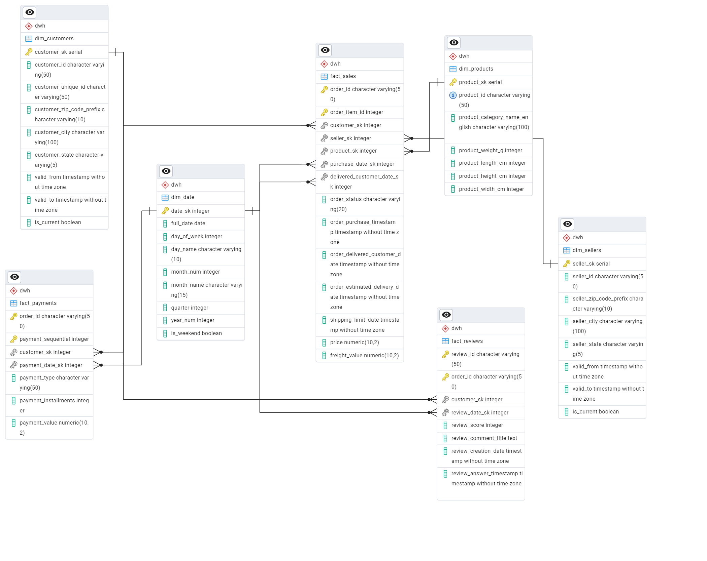

# 📊 Olist E-commerce Data Warehouse

## 👤 Student
**Amran Al-gaafari**

---

## 📌 Project Overview
This project demonstrates the end-to-end process of building an Enterprise-grade **Data Warehouse (OLAP)** from a raw **OLTP system** using the Brazilian Olist e-commerce dataset. 

The pipeline includes:
* **Extraction:** Pulling raw data from an SQLite database.
* **Staging:** Loading data into a temporary PostgreSQL schema to ensure data quality and handle incremental updates.
* **Transformation:** Using Python (pandas) to apply business logic, handle surrogate keys, and implement Slowly Changing Dimensions (SCD).
* **Loading:** Populating a highly optimized PostgreSQL Data Warehouse.
* **Reporting:** Generating analytical queries for deep business insights.

---

## 🧱 Architecture
```text
  SQLite (Raw OLTP)
         ↓
Python ETL Pipeline (pandas + SQLAlchemy)
         ↓
PostgreSQL (Staging Schema)
         ↓
PostgreSQL (DWH Schema - Galaxy Schema)
         ↓
Analytical Queries (SQL)
```

---

## 🧩 Data Modeling

### ⭐ Fact Constellation (Galaxy Schema) Design
To avoid the "Chasm Trap" and ensure precise granularity, the Data Warehouse follows a **Fact Constellation** (Galaxy Schema) approach, where multiple fact tables share conformed dimensions.

### 📦 Fact Tables
* **`fact_sales`** → Granularity: One row per order item. Tracks product sales and delivery performance.
* **`fact_payments`** → Granularity: One row per payment sequential. Tracks revenue and payment methods.
* **`fact_reviews`** → Granularity: One row per customer review. Tracks customer satisfaction.

### 📦 Dimension Tables
* **`dim_customers`** → (SCD Type 2: Tracks customer location changes over time).
* **`dim_sellers`** → (SCD Type 2: Tracks seller location changes over time).
* **`dim_products`** → (SCD Type 1: Includes English category translations).
* **`dim_date`** → (Comprehensive date dimension for robust time-series analysis).

---

## 🖼️ Schema Diagrams

### OLTP Source


### Data Warehouse


---

## ⚙️ ETL Pipeline

The ETL process is implemented using a clean, modular Python structure:

* `src/db_config.py` → Database connection and environment management.
* `src/extract.py` → Extracts data, handles timestamp conversions (Data Quality), and loads incrementally to Staging.
* `src/transform_load.py` → Transforms data, applies SCD Type 1 & 2 logic, generates Surrogate Keys, and populates the DWH.
* `src/main_pipeline.py` → Master orchestrator for pipeline execution and error handling.

---

## ▶️ How to Run

1. **Activate Virtual Environment:**
```bash
python -m venv venv
# On Windows
.\venv\Scripts\activate
# On Mac/Linux
source venv/bin/activate
```

2. **Install dependencies:**
```bash
pip install -r requirements.txt
```

3. **Set environment variables:** 
Create a `.env` file in the root directory with your PostgreSQL credentials:
```env
PG_USER=postgres
PG_PASSWORD=your_password
PG_HOST=localhost
PG_PORT=5432
PG_DB=olist_dwh
```

4. **Run the End-to-End ETL Pipeline:**
```bash
python src/main_pipeline.py
```

---

## 📊 Sample Analytical Queries

Located in: `sql/analytical_queries.sql`

**Key Business Insights Covered:**
* Sales and order trends over time.
* Most valuable customers (Top spenders).
* Top product categories driving revenue.
* Delivery performance analysis (average delay by seller state).

---

## 🎯 Key Features
* **Fact Constellation Modeling:** Eliminates data duplication across different business processes.
* **Slowly Changing Dimensions (SCD Type 2):** Retains historical accuracy for customer and seller addresses.
* **Incremental Loading:** Uses timestamp watermarking to load only new records, saving compute resources.
* **Data Quality Handling:** Automated conversion of string dates to clean timestamps during extraction.
* **Modular & Scalable Pipeline:** Clean code architecture using Python and SQL.

---

## 🛠 Tools Used
* **Languages:** Python, SQL
* **Libraries:** pandas, SQLAlchemy, python-dotenv, psycopg2
* **Databases:** PostgreSQL (Target DWH), SQLite (Source OLTP)
* **IDE & Management:** VS Code, pgAdmin / DBeaver

---

## ✅ Conclusion
This project successfully transforms raw transactional data into a robust, structured Data Warehouse optimized for high-performance analytics, reporting, and historical tracking.