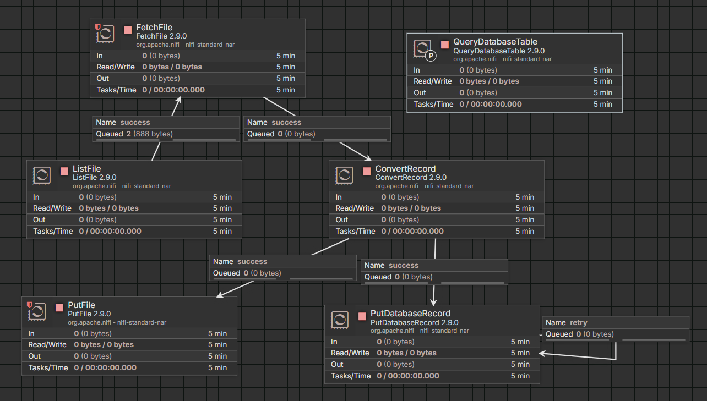
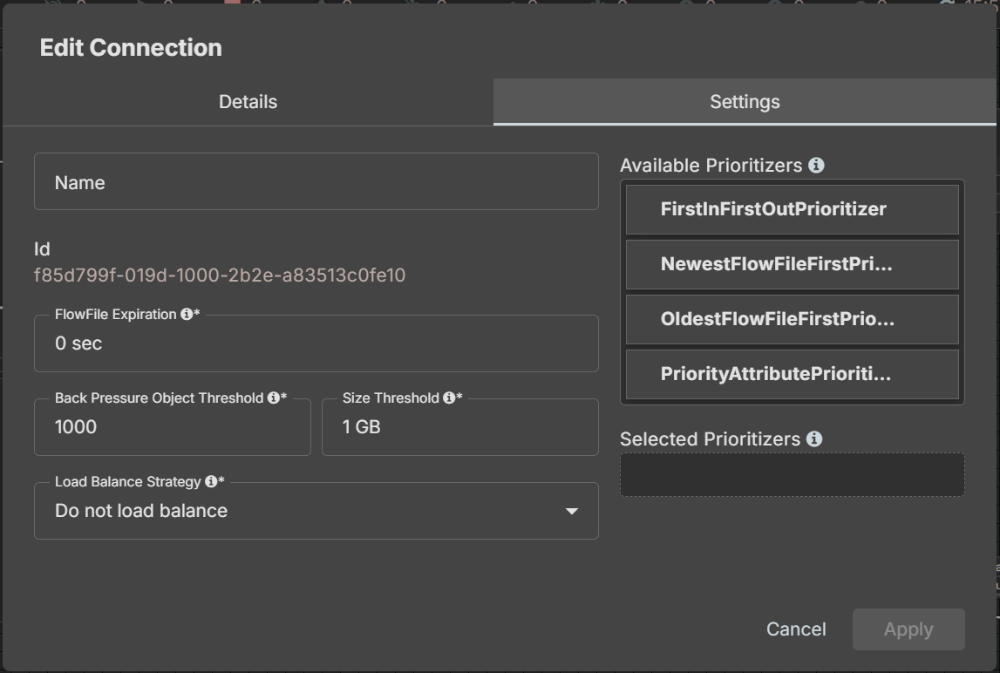
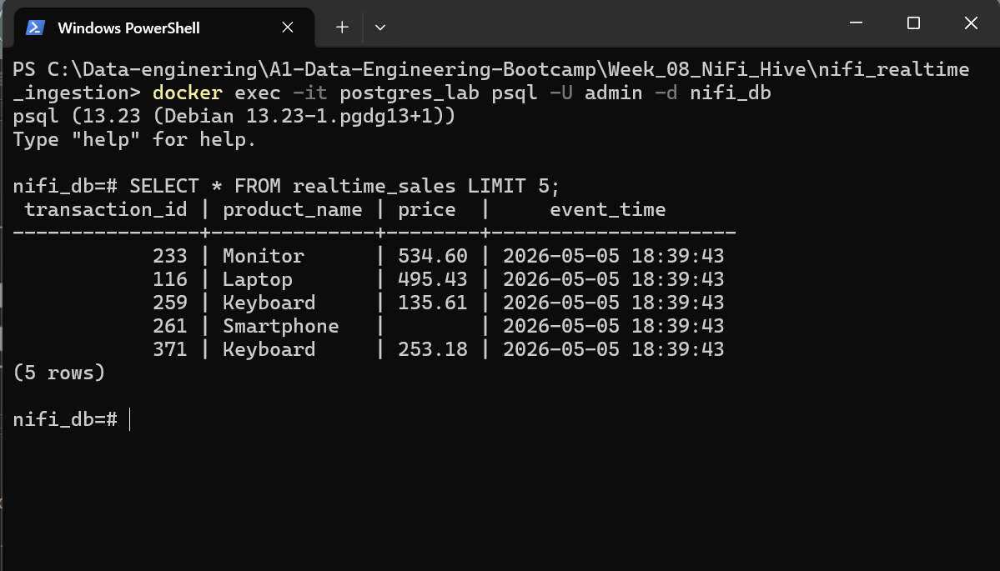
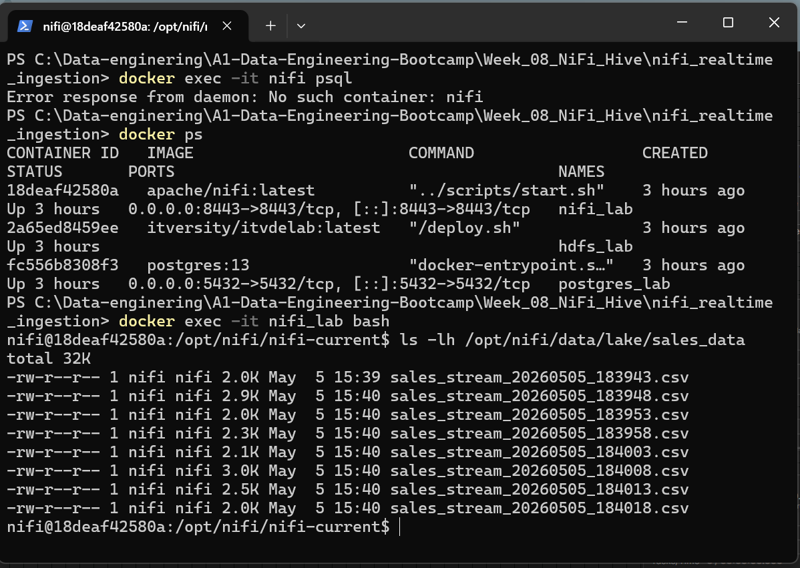
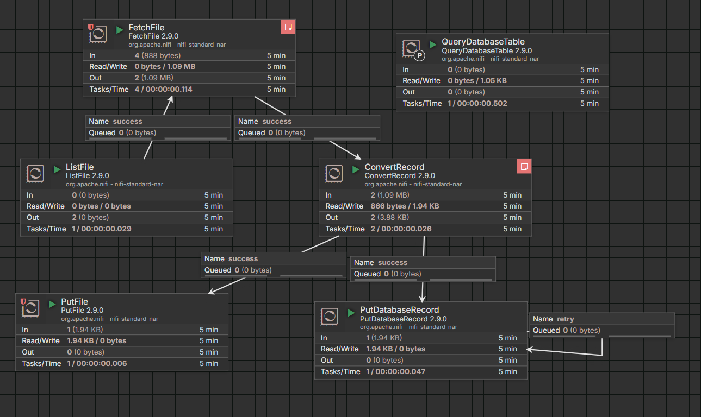

# 🚀 Real-Time Enterprise Data Pipeline with Apache NiFi
**Author:** Amran Al-gaafari  
**Project:** End-to-End Real-Time Ingestion & Processing Pipeline  
**Date:** May 2026  

---

## 📌 1. Project Objective
The primary goal of this project is to design and implement a scalable, production-grade data ingestion pipeline using **Apache NiFi**. The architecture orchestrates a continuous flow of retail data from a simulator into a dual-storage destination: **PostgreSQL** for structured analytics and a **Local Data Lake** for raw data archiving.

---

## 🏗️ 2. System Architecture
The pipeline follows a decoupled architecture to ensure high availability and efficient data processing.

| Component | Technology | Role |
| :--- | :--- | :--- |
| **Source** | Python Simulator | Generates real-time, semi-structured CSV data. |
| **Orchestrator** | Apache NiFi 2.9.0 | Manages ingestion, transformation, and distribution. |
| **Database** | PostgreSQL 13 | Structured storage with **UPSERT** logic for deduplication. |
| **Data Lake** | Local File System | Archiving raw CSV files for future re-processing. |

### 🖼️ Pipeline Visualization
  
*Figure 1: Full NiFi Flow visualization demonstrating dual-destination routing.*

---

## 🛠️ 3. Comprehensive Requirement Coverage

### 🔹 3.1 Real-Time Data Simulation (Item #1)
* Developed a custom Python script to simulate a continuous stream of retail transactions.
* Engineered the stream to include **"messy data"** (e.g., records with missing price values) to test pipeline robustness.

### 🔹 3.2 Ingestion & Transformation (Items #2 & #4)
* **Stateful Ingestion**: Implemented the mandatory `ListFile` ➔ `FetchFile` strategy to maintain ingestion state and prevent duplicates.
* **Data Pivot**: Leveraged `ConvertRecord` to transform raw CSV data into structured JSON, ensuring compatibility with modern data formats.

### 🔹 3.3 Relational Storage & Incremental Extraction (Item #3)
* **UPSERT Logic**: Configured `PutDatabaseRecord` to handle data deduplication automatically based on the `transaction_id`.
* **Incremental Fetch**: Successfully implemented incremental data retrieval using a tracking column to fetch only newly added records from the source.

### 🔹 3.4 Reliability Engineering & Best Practices (Item #6)
* **Back Pressure**: Established an object threshold of **1000** on connections to prevent memory overflow during high-traffic spikes.
* **Fault Tolerance**: Configured recursive **Retry Relationships** on database processors to handle transient connection failures automatically.

  
*Figure 2: Technical verification of Back Pressure configuration (Object Threshold: 1000).*

### 🔹 3.5 Additional Ingestion Technique (Item #7)
* Integrated a secondary ingestion method using the `QueryDatabaseTable` processor, demonstrating the ability to pull data from RDBMS sources in addition to standard file-based streams.

---

## 📊 4. Verification and Results

### ✅ 4.1 Database Integrity (PostgreSQL)
The pipeline successfully ingested live streams, demonstrating robust handling of NULL values (e.g., transaction `261`):



### ✅ 4.2 Data Lake Verification
Verified the raw archiving layer inside the `nifi_lab` container, confirming the persistence of raw CSV files:

  
*Files verified at `/opt/nifi/data/lake/sales_data`.*

### ✅ 4.3 Execution Metrics
The pipeline maintains a **Zero Queued** state, indicating optimal processor configuration and throughput:



---

## 🚀 5. Deployment Guide
1. **Container Setup**: Ensure `nifi_lab` and `postgres_lab` containers are running.
2. **Service Activation**: Enable `DBCPConnectionPool`, `CSVReader`, and `JsonRecordSetWriter`.
3. **Run Pipeline**:
   ```bash
   # Execute the data simulator
   python data_simulator.py
   
```
4. **Audit**: Monitor the NiFi UI for real-time traffic flow and check the PostgreSQL table for record updates.