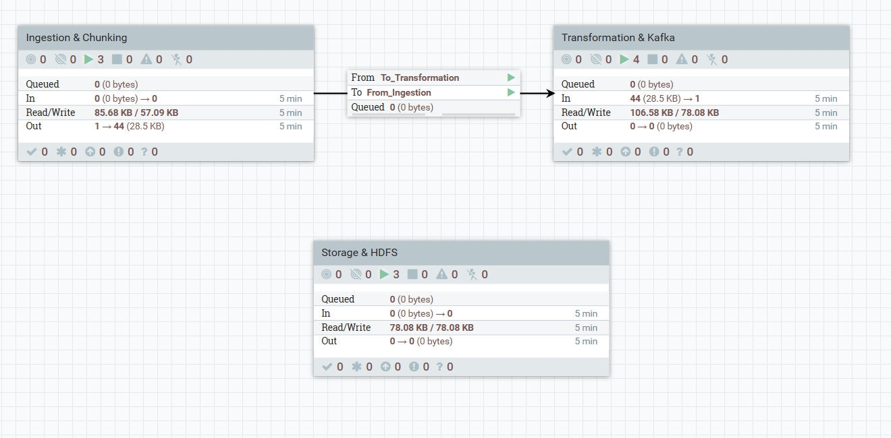
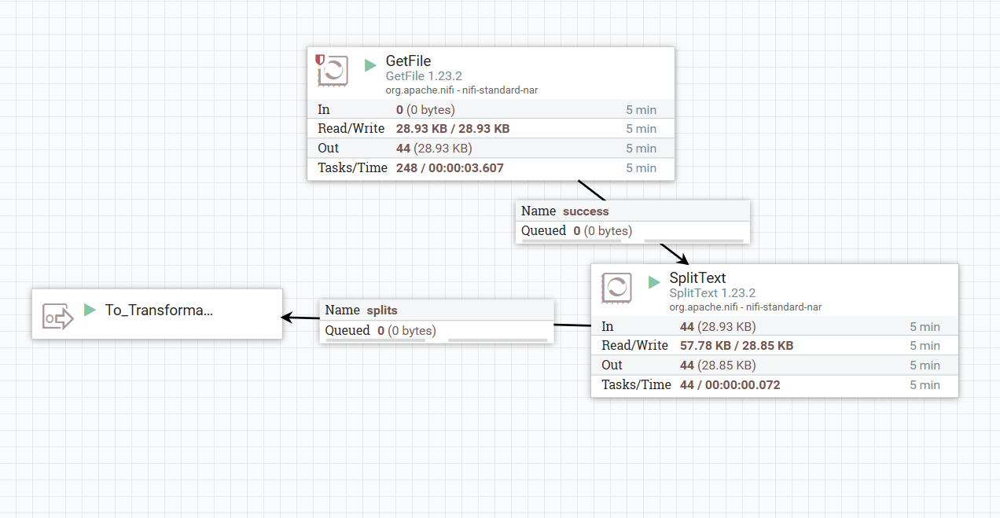
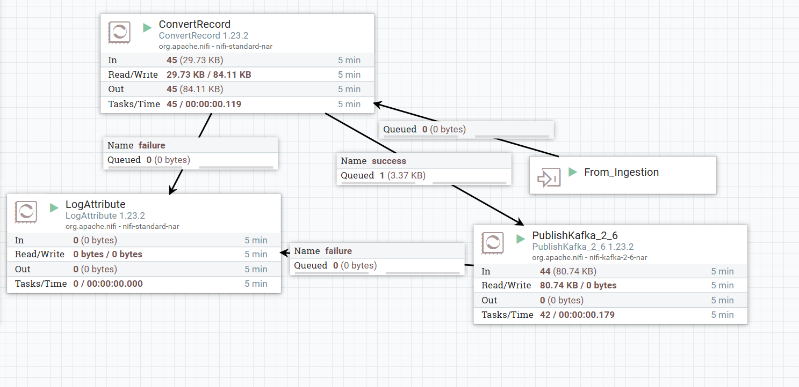
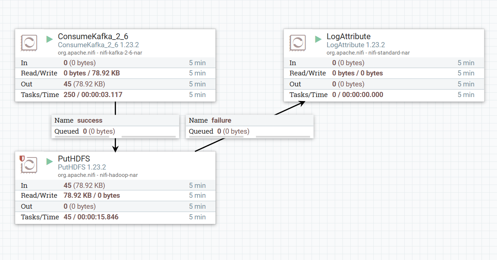
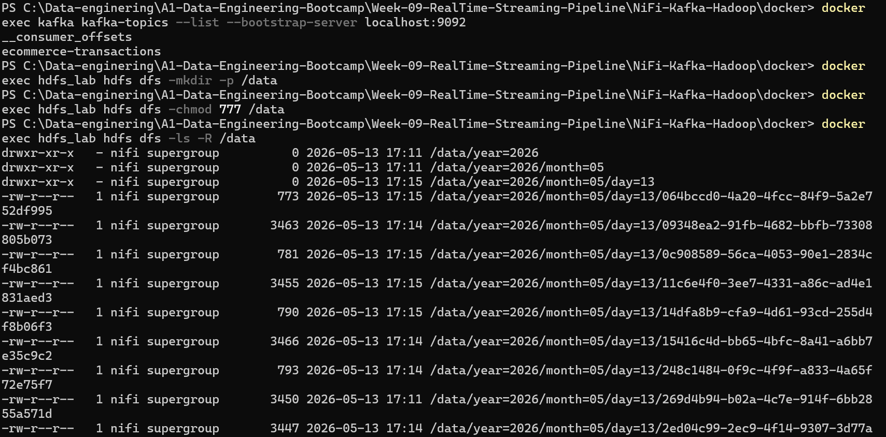

# 🚀 Real-Time Data Engineering Pipeline: NiFi, Kafka, & Hadoop


## 📌 Project Overview
This repository contains a fully containerized, real-time data engineering pipeline designed to handle high-throughput streaming data. The project fulfills all requirements of the **Real-Time Data Pipeline Assignment (Week 09)**. It simulates e-commerce business transactions, processes them in real-time handling messy data, transforms the schema, and stores the results in a dynamically partitioned Data Lake (HDFS).

---

## 📂 Repository Structure

```text
NiFi-Kafka-Hadoop/
├── docker/                  # Docker infrastructure (Compose, .env, Hadoop configs)
├── src/                     # Python Streaming Data Generator source code
├── nifi_pipeline/           # Exported NiFi Flow definition (.json)
├── kafka_scripts/           # Kafka topic creation & management commands
├── docs/                    # Architecture diagrams and HDFS proof screenshots
│   ├── hdfs_screenshots/
│   │   ├── 01_ingestion_chunking.png
│   │   ├── 02_transformation_kafka.png
│   │   ├── 03_consumption_hdfs.png
│   │   └── 04_hdfs_output_terminal.png
│   ├── architecture_diagram.png
│   └── technical_report.md  # Detailed technical documentation
├── .gitignore               # Git ignore rules
└── README.md                # Project documentation (You are here)
```

---

## 🏗️ Architecture & Data Flow



The pipeline follows a decoupled microservices architecture:
1. **Python Generator:** Simulates a real-time stream of messy e-commerce CSV data.
2. **Apache NiFi (Ingestion):** Ingests the CSV files and chunks them (< 64KB).
3. **Apache NiFi (Transformation):** Validates and converts the CSV data into structured JSON.
4. **Apache Kafka:** Acts as the message broker, receiving JSON payloads to decouple ingestion from storage.
5. **Apache NiFi (Consumer):** Reads from Kafka and routes data to Hadoop.
6. **Apache Hadoop (HDFS):** Stores the final JSON files using dynamic, time-based partitioning.

---

## ⚙️ Detailed Implementation & Visuals

### 1. Data Ingestion & Chunking
The `GetFile` processor continuously monitors the ingestion directory. To optimize memory and processing time, the `SplitText` processor ensures that incoming files are chunked into sizes no larger than **64 KB**.



### 2. Data Transformation & Kafka Publishing
Messy CSV data is routed through the `ConvertRecord` processor, which applies a strict schema to filter out malformed rows (routing them to a Dead Letter Queue) and converts valid records into JSON. The clean JSON is then published to the `ecommerce-transactions` Kafka topic.



### 3. Kafka Consumption & HDFS Storage
A separate NiFi group consumes the messages from Kafka. The `PutHDFS` processor then dynamically evaluates the timestamp of the FlowFiles to write them into partitioned HDFS directories (`/data/year=YYYY/month=MM/day=DD`).



### 4. Final HDFS Output (Proof of Execution)
The pipeline successfully writes partitioned data into Hadoop. Below is the terminal output showing the dynamically created directories and the stored JSON files:



---

## 🛡️ Reliability & Error Handling
* **Back Pressure & Queue Management:** Configured across all connections to prevent OutOfMemory (OOM) errors during data spikes.
* **Dead Letter Queues (DLQ):** Failed transformations are routed to `LogAttribute` processors for monitoring instead of being dropped.
* **Retry Mechanisms:** Network processors (`PutHDFS`, `PublishKafka`) use Yield Durations and Penalizations to handle transient connection drops safely.

---

## 🚀 How to Run the Project

### 1. Start the Infrastructure
Navigate to the `docker/` directory and bring up the cluster:
```bash
cd docker
docker-compose up -d
```

### 2. Configure Kafka
Execute the commands in `kafka_scripts/kafka_commands.txt` to create the required topic inside the Kafka container:
```bash
docker exec kafka kafka-topics --create --topic ecommerce-transactions --bootstrap-server localhost:9092 --partitions 1 --replication-factor 1
```

### 3. Deploy NiFi Flow
1. Access NiFi UI at `http://localhost:8080/nifi`.
2. Upload the `nifi_pipeline/nifi_flow_export.json` template.
3. Instantiate the template and start all processor groups.

### 4. Start the Data Generator
Navigate to the Python source folder, install requirements, and run the simulator:
```bash
cd src/streaming_generator
pip install -r requirements.txt
python main.py
```

---

## 🛠️ Challenges Overcome
* **Docker Internal DNS Resolution:** Resolved `TimeoutException` in Kafka by pointing NiFi processors to the internal Docker network alias `kafka:29092` instead of `localhost`.
* **HDFS External Binding:** Modified Hadoop's `core-site.xml` to bind `fs.defaultFS` to `0.0.0.0:9000` to accept connections from the NiFi container.
* **HDFS Write Permissions:** Executed `chmod 777 /data` inside the HDFS container to grant the NiFi user proper execution and write privileges for dynamic directory creation.

---
*Developed by Amran Al-gaafari | A1 Data Engineering Bootcamp*